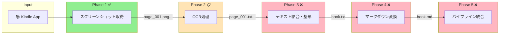
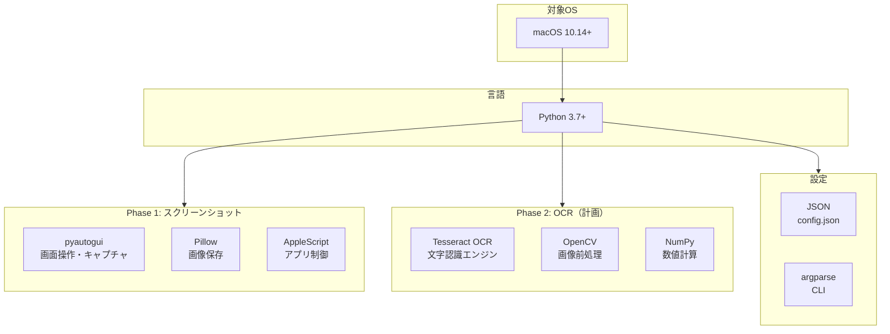
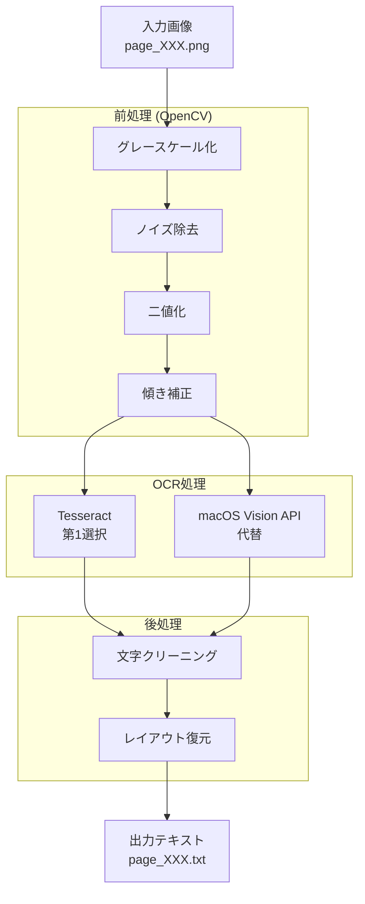

# Kindle本テキスト抽出システム

Kindleアプリから書籍をテキスト化し、マークダウンに変換する自動化パイプライン

## 全体パイプライン



## 技術スタック



## ディレクトリ構成

```
kindle/
├── CLAUDE.md                    # プロジェクト計画書
├── README.md                    # このファイル
├── phase1_screenshot/           # ✅ 実装完了
│   ├── capture.py              # メインスクリプト
│   ├── config.json             # 設定ファイル
│   └── README.md
└── phase2_ocr/                  # 📋 計画完了
    ├── README.md
    └── phase2_implementation_plan.md
```

## 実装状況

| Phase | 内容 | 状態 | 出力物 |
|-------|------|------|--------|
| 1 | スクリーンショット取得 | ✅ 完了 | `page_XXX.png` |
| 2 | OCR処理 | 📋 計画済 | `page_XXX.txt` |
| 3 | テキスト結合・整形 | ❌ 未着手 | `book.txt` |
| 4 | マークダウン変換 | ❌ 未着手 | `book.md` |
| 5 | パイプライン統合 | ❌ 未着手 | 統合CLI |

## Phase 2 OCR の技術選定



**品質目標**: 認識率95%以上、処理速度2-5秒/ページ

## クイックスタート

### Phase 1: スクリーンショット取得

```bash
# 依存関係のインストール
pip install pyautogui pillow

# 実行
cd phase1_screenshot
python capture.py --book "書籍名" --pages 100
```

詳細は [phase1_screenshot/README.md](./phase1_screenshot/README.md) を参照
